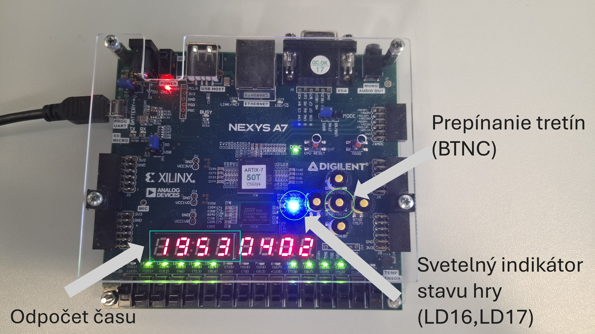
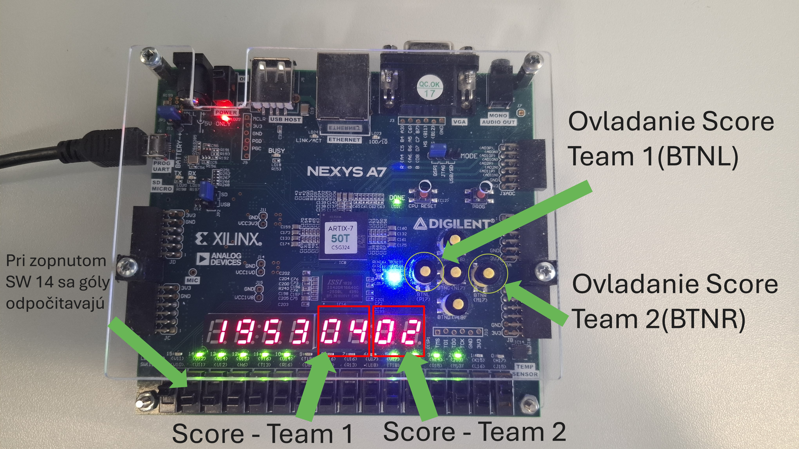
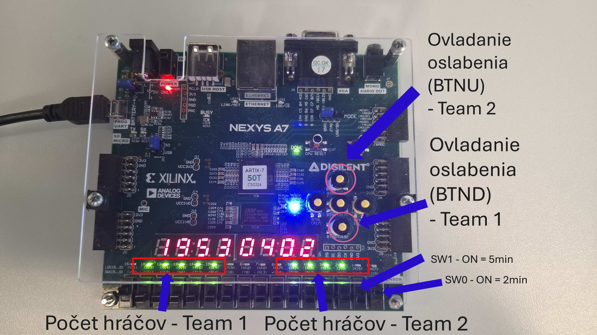
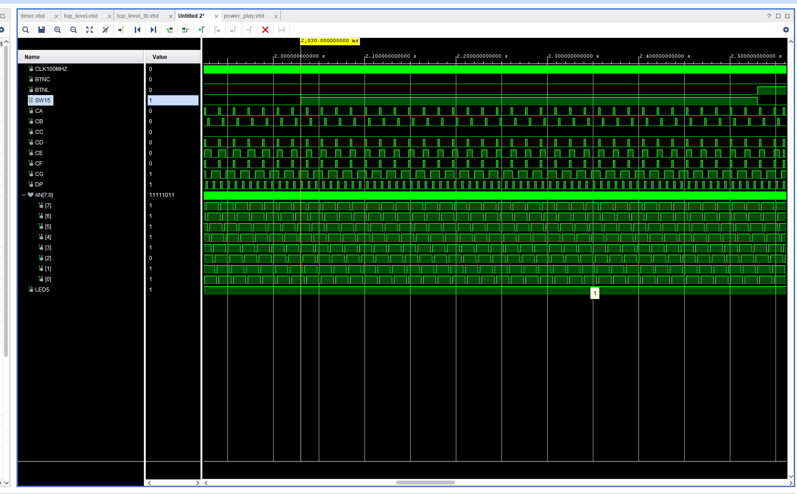
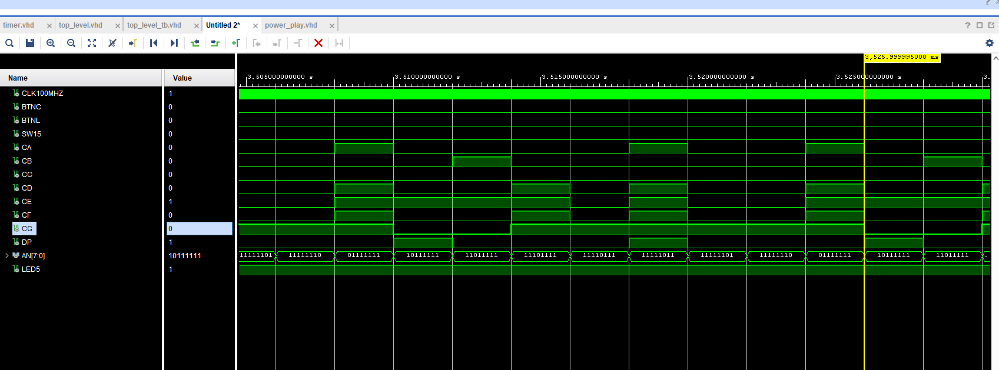
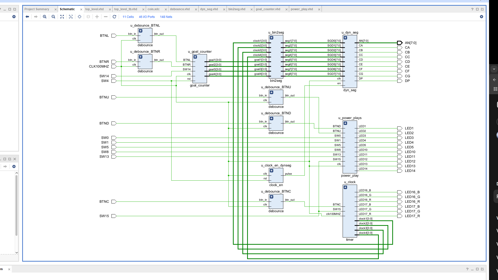

# BPC-DE1 Projekt
# Digital scoreboard

*Vysoké učení technické v Brně, Fakulta elektrotechniky a komunikačních technologií, letný semester 2024/2025*

## Členovia tímu

- **Jakub Kotačka** – Návrh, programovanie
- **Martin Švéda** – Návrh, programovanie
- **Rastislav Štefan Sokol** – Návrh, pomoc s programovaním, dokumentácia

# Teoretický popis, vysvetlenie

## Power Play – Použitie

### Výber hranej tretiny

Výber aktuálnej hranej tretiny prebieha pomocou tlačidla **BTNC**.

Pri spustení dosky je automaticky nastavená **prvá tretina** s trvaním **20 minút**, ktorá je signalizovaná **modrým svetlom na LED LD16**.

*obr. 1*

Prepínanie jednotlivých tretín prebieha stláčaním tlačidla **BTNC** nasledovne:
- **1. stlačenie** – nastaví **druhú tretinu** (20 minút), signalizovanú **zelenou farbou**.
- **2. stlačenie** – nastaví **tretiu tretinu** (20 minút), signalizovanú **červenou farbou**.
- **3. stlačenie** – nastaví **predĺženie** (10 minút), signalizované **súčasným svietením LED LD16 a LD17**.
- **4. stlačenie** – nastaví režim **nájazdov**, kedy:
  - Na časovači svietia **všade nuly**,
  - **LD17** svieti **červeno**,
  - **LD16** svieti **modro**.

Každým ďalším stlačením **BTNC** sa celý cyklus opakuje od prvej tretiny.

### [Tretiny_video](./Videos/Thirds.mp4)
---
## Goal Counter

*obr. 2*
### Definícia tímov
- **Tím 1** – tím, ktorého skóre je na **ľavej strane** ukazovateľa skóre.
- **Tím 2** – tím, ktorého skóre je na **pravej strane** ukazovateľa skóre.

---

### Pridávanie skóre

- **BTNL** – pridanie gólu tímu 1
- **BTNR** – pridanie gólu tímu 2
- **SW14** musí byť **vypnutý** pri pridávaní skóre.

---

### Uberanie skóre

- Zapnúť **SW14**.
- Pomocou **BTNL** alebo **BTNR** uberieme skóre príslušnému tímu.

---

### Reset skóre

- Pomocou **SW4** je možné úplne resetovať skóre na **00:00**.
- Pri aktivácii a následnej deaktivácii **SW4** sa skóre vynuluje a ukazovateľ skóre je pripravený na nové použitie.

### [Goals_video](./Videos/Goals.mp4)
---

### Pridávanie presiloviek

*obr. 3*
### Definícia tímov
- **Tím 1** – tím, ktorého skóre je na **ľavej strane** ukazovateľa skóre, má vyhradené ledky LD10 - LD14 (tie vľavo).

- **Tím 2** – tím, ktorého skóre je na **pravej strane** ukazovateľa skóre, má vyhradené ledky LD1 - LD5 (tie vpravo).

Pridávanie presiloviek prebieha pomocou kombinácie tlačidiel **BTNU** alebo **BTND** a prepínačov **SW0** alebo **SW1**.

Pridávanie funguje tak, že **musí byť zastavený hlavný časovač** (len vtedy je možné presilovku pridať).

### Výber typu presilovky:
- **SW0** – dvojminútová presilovka
- **SW1** – päťminútová presilovka

### Výber tímu:
- **BTNU** – presilovka pre tím 1
- **BTND** – presilovka pre tím 2

V momente udelenia presilovky **zhasne jedna LED-ka** tímu, ktorý bude hrať v oslabení.  
Každý tím má 5 LED-iek reprezentujúcich 5 hráčov na ľade. Maximálne môžu zhasnúť 2 LED-ky, keďže na ľade musia byť vždy minimálne traja hráči (plus brankár).

Po opätovnom spustení času sa začne odpočítavať čas presilovky, avšak **len ak je hlavný časovač spustený**.

Po uplynutí 2 alebo 5 minút sa LED-ka tímu, ktorý bol v oslabení, **automaticky rozsvieti**, čo signalizuje návrat hráča na ľad.

---

## Uberanie presiloviek

Presilovky je možné aj **odobrať**, pričom sa vymaže práve jedna presilovka a jej čas sa zabudne.  
Uberanie funguje **len v prípade zastaveného hlavného časovača**.

### Postup:
1. Pomocou **SW15** zastavíme hlavný časovač.
2. Zapneme **SW8** pre zrušenie presilovky tímu 2 (zrušenie oslabenia tímu 1).
3. Zapneme **SW5** pre zrušenie presilovky tímu 1 (zrušenie oslabenia tímu 2).

Po tomto úkone sa **automaticky rozsvieti LED-ka** príslušného tímu.

Táto funkcionalita je určená na manuálne rušenie presiloviek/oslabení, napríklad v prípade streleného gólu.

### Poznámky:
- V prípade viacerých presiloviek (viac ako 2) sa časy pribudajúcich presiloviek **sčítavajú**. Štvrtá LED-ka tímu sa rozsvieti až po ukončení predchádzajúcich presiloviek (keď ostane na odpocitanie už len jedna presilovka).
- **Rušenie presiloviek je možné len pre dvojminútové presilovky**, päťminútové presilovky nie je možné rušiť gólom.

### [Power_plays_video](./Videos/Power_plays.mp4)

## Simulácie

Pre overenie správnej funkčnosti boli vytvorené testbenche:

- **`tb_power_play.vhd`**, **`tb_top_level.vhd`**  
  Slúžia na testovanie správneho chodu presiloviek, časovača, skóre a stavového automatu.

Každý hlavný modul bol simulovaný samostatne s cieľom overiť správnosť jeho správania pred syntézou a implementáciou.

### Zobrazenie času

*obr. 4*
### Simulácia gólu

*obr. 5*

### [Simulations_goal_counter](./Simulations/simulacie_goal_counter.pdf)

### [Simulations_power_play](./Simulations/simulacie_power_play.pdf)

 

## Opis hardvérového návrhu

Projekt bol kompletne implementovaný na vývojovej doske Nexys A7-50T bez potreby ďalších externých hardvérových súčiastok. 

## Zobrazovanie na sedemsegmentovom displeji (8 segmentov)

Zobrazovanie údajov (čas a skóre) prebieha pomocou **dynamického multiplexovania** všetkých ôsmich sedemsegmentových displejov na doske **Nexys A7-50T**.

### Princíp fungovania

- Výstupné údaje (čas alebo skóre) sú rozdelené na jednotlivé číslice, pričom každá číslica je prevedená na **BCD formát** pomocou modulu **`bin2seg`**.
- Modul **`dyn_seg`** postupne a rýchlo **aktivuje jednotlivé displeje**, pričom v každom okamihu svieti iba jeden z ôsmich segmentov.
- Prepínanie medzi segmentmi prebieha **vysokou frekvenciou** (typicky stovky Hz), aby ľudské oko vnímalo všetky číslice ako svietiace naraz bez blikania.
- Každému displeju je **dynamicky priradená hodnota**, ktorá sa na ňom má zobrazovať (napríklad minúty, sekundy, skóre tímov a pod.).
- Celé zobrazovanie je **plne synchronizované** s hlavnými hodinami systému.

## Schéma

*obr. 6*

### Použitie displejov

Displeje sa používajú na zobrazovanie:
- Hracieho času (minúty a sekundy),
- Skóre tímu 1 (ľavá časť displeja),
- Skóre tímu 2 (pravá časť displeja),
- Prípadne ďalších stavov ako predĺženie alebo nájazdy.

### Výhoda riešenia

- Vďaka multiplexovaniu systém potrebuje iba **minimálny počet signálov** na ovládanie všetkých ôsmich displejov.
- **Úspora hardvérových zdrojov** (logiky a vedení) a efektívne riadenie zobrazovania.

---

## Zdrojové kódy

Projekt obsahuje nasledovné hlavné komponenty:

- **`timer.vhd`** – časovač  
  Generuje základné časové impulzy pre odpočítavanie času tretín a presiloviek.

- **`goal_counter.vhd`** – počítadlo skóre  
  Správa pridávania, uberania a resetovania skóre tímov.

- **`power_play.vhd`** – správa presiloviek  
  Rieši logiku pridávania, rušenia a správy stavu presiloviek.

- **`dyn_seg.vhd`** – ovládač sedemsegmentového displeja  
  Multiplexné zobrazovanie čísel na štvormiestnom displeji.

- **`bin2seg.vhd`** – prevodník binárneho čísla na sedemsegmentový kód  
  Zabezpečuje konverziu binárneho čísla na správne zobrazovanie číslic.

- **`debounce.vhd`, `debounce2.vhd`, `debounce3.vhd`** – stabilizácia tlačidiel  
  Odstraňujú zákmity signálu z mechanických tlačidiel (pre BTNU, BTND, BTNC, BTNL, BTNR).

- **`clock_en.vhd`** – generátor hodinového povolenia  
  Znižuje frekvenciu hlavného hodinového signálu na požadovanú frekvenciu pre logiku systému.

- **`top_level.vhd`** – hlavný riadiaci komponent  
  Integruje všetky vyššie uvedené komponenty a riadi celý chod systému vrátane prepínania tretín, riadenia presiloviek a správy skóre.

## Zhrnutie

Projekt bol kompletne implementovaný vo vývojovom prostredí **Vivado** pre FPGA dosku **Nexys A7-50T**.  
Nepoužívali sa žiadne ďalšie externé hardvérové súčiastky.  
Výsledkom je generovaný **bitstream `top_level.bit`**, ktorý sa nahráva do FPGA čipu pre spustenie systému.

